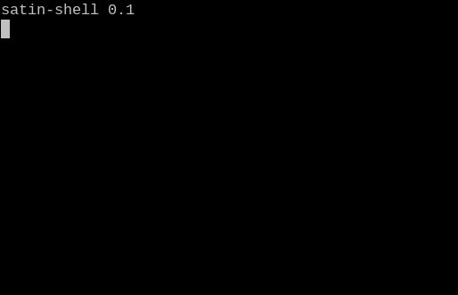

satin-blocks
============

What is satin-blocks?
--------------------

Satoshi interpreter building blocks, a commandline toolbox for composing Bitcoin script development tools.
Satin is architected as a collection of pipable building blocks and composed applications, inspired by git, gstreamer and the Unix philosophy.

#### Usage

satin-shell is a simple interactive shell created for educational purposes.
Due to lack of advanced features, it is meant to get replaced as default interpreter.

Simple usage example of satin-shell:



```
satin-shell 0.1
satin-0.1$ OP_1 OP_1 OP_EQUALVERIFY
Success
satin-0.1$ op_1 Op_1 Op_equalVerIfy
Success
satin-0.1$ 1 1 equalverify
Success
satin-0.1$ 1 2 equalverify
Script failed an OP_EQUALVERIFY operation
satin-0.1$ 0x12abef 0x5632 equalverify
Script failed an OP_EQUALVERIFY operation
satin-0.1$ 0x123456 dup equalverify
Success
satin-0.1$
```

Looking at the satin-shell code illustrates the UNIX principles of simple building blocks.
The code below is the full implementation of a working satin shell written in bash.
```
prefix="satin-0.1$"
echo "satin-shell 0.1"
echo -n "${prefix} "
while read input
do
    echo $input | satin-compile | satin-run
    echo -n "${prefix} "
done < /dev/tty
```

For more information, checkout the individual blocks and applications.

#### Blocks

| Name                                     | Lang | Description |
|------------------------------------------|------|-------------|
| [satin-compile](src/compile/README.md)   | C++  | Satoshi script compiler: translates human readable scripts into binary input for the runtime (satin-run). |
| [satin-run](src/run/README.md)           | C++  | Satoshi runtime: runtime for compiled scripts. |

#### Applications

| Name                                     | Lang | Description |
|------------------------------------------|------|-------------|
| [satin](src/satin/README.md)             | Bash | Main entry point of the satin-blocks suite. |
| [satin-shell](src/shell/README.md)       | Bash | Simple shell for interactive script evaluation. |

#### Donations

Donations appreciated on:

| Coin           | Address                                        |
|----------------|------------------------------------------------|
| Bitcoin Segwit | bitcoin:1BTCVmeapxFfLLJMnfBpWziyrXQPFaPzJT     |
| Bitcoin Cash   | bitcoincash:1BCCrNsErzdnybNciwiMuEYeVgPbBCF8JN |
| Bitcoin Cash   | bitcoincash:1BCHeoUAbf8ntgLCBtgF2Dt6Aid6jBGXv9 |
| Peercoin       | peercoin:PSATsp46WF9S1bPPRvVSszBmrda3U5627s    |

OS support
----------

- GNU/Linux: fully supported.
- POSIX (including Cygwin): all code should be POSIX compliant, but builds might break.
- Windows: compatibility fixes are accepted if not too invasive, otherwise use Cygwin.

License
-------

satin-blocks is released under the terms of the GPLv3 license. See [LICENSE.md](LICENSE.md) for more
information or see https://opensource.org/licenses/GPL-3.0.

Compiling from source
---------------------

#### Dependencies

C++11 compliant compiler
CMake
Boost

#### Build steps

Satin statically links to bitcoinclassic's libbitcoin_*.a libraries.
CMake is able to autodetect headers and libs when installed in include and lib folders.
If not, fetch and compile them using the build-libbitcoin script:

```
scripts/build-libbitcoin.sh
```

Building satin:

```
scripts/build.sh
```

If you are familiar with CMake, the `build.sh` script is a simple wrapper around the cmake and make command, make sure to check it out.

Installing satin:

```
cd build
sudo make install
```

Contributing
------------

satin-blocks are composable blocks that can be built using any language or technology.
Contributions should adhere to the Unix philosophy as stated below.
To be considered for acceptance, contributed blocks need to nicely integrate with the build system and strong arguments should be applied to the choice of language or technology.

#### Unix philosophy

The UNIX philosophy is documented by Doug McIlroy in the Bell System Technical Journal from 1978:

- Make each program do one thing well. To do a new job, build afresh rather than complicate old programs by adding new "features".
- Expect the output of every program to become the input to another, as yet unknown, program. Don't clutter output with extraneous information. Avoid stringently columnar or binary input formats. Don't insist on interactive input.
- Design and build software, even operating systems, to be tried early, ideally within weeks. Don't hesitate to throw away the clumsy parts and rebuild them.
- Use tools in preference to unskilled help to lighten a programming task, even if you have to detour to build the tools and expect to throw some of them out after you've finished using them.

Satin does not fully comply with the second rule for the communication with the runtime `statin-run`.
Communication with the runtime uses a binary representation of input scripts and runtime output.
The binary runtime protocol makes the system more modular by allowing reimplementation of the pre- and post-processors of the runtime.

For more information read Eric Raymond’s 17 Unix Rules in [UNIX_RULES.md](UNIX_RULES.md).

#### Preferred languages/technologies

- C++
- Rust
- Bash
- Python3
- C

#### Rejected languages/technologies

- node.js
- Python2
- JVM
- .Net
- Go
